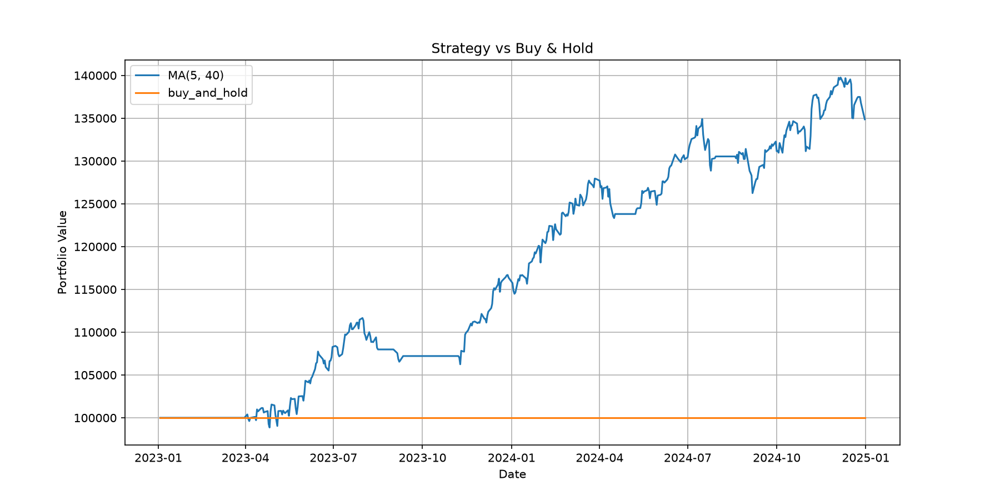

# Quant Platform 

A python based algorithmic trading backtest framework with walk-forward optimization and multi-asset suppot 




## Features
- **Walk-forward optimization** - train on histrical data, test on unseen period to avoid overfitting 
- **Multi-asset support** - run strategies across multiple tickers simultaneously
- **Strategy comparison** - benchmark MA Cross strategy against BUY & HOLD
- **Equity curve visualization** - plot portfolio over time 
- **Automated reporting** - export results to CSV 

## Strategies 

| Strategy | Description |
|----------|-------------|
| MA Cross | Moving average crossover (fast/slow configurable) |
| Buy & Hold | Benchmark strategy |


## Project Structure 
```
quant-platform/
├── src/
│   ├── engine.py        # Core backtest runner, optimizer
│   ├── strategies.py    # MA Cross, Buy & Hold strategies
│   ├── analyzers.py     # Custom Backtrader analyzers
│   └── plotting.py      # Equity curve visualization
├── backtests/
│   └── run_walk_forward.py   # Main entry point
├── data/
│   └── raw/             # Yahoo Finance CSV data
└── reports/             # Output CSV + charts
```

