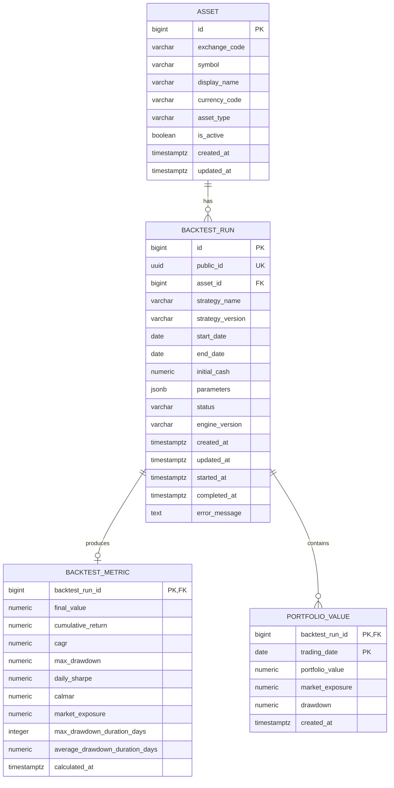

```mermaid
erDiagram
    ASSET ||--o{ BACKTEST_RUN : "has"
    BACKTEST_RUN ||--o| BACKTEST_METRIC : "produces"
    BACKTEST_RUN ||--o{ PORTFOLIO_VALUE : "contains"

    ASSET {
        bigint id PK
        varchar exchange_code
        varchar symbol
        varchar display_name
        varchar currency_code
        varchar asset_type
        boolean is_active
        timestamptz created_at
        timestamptz updated_at
    }

    BACKTEST_RUN {
        bigint id PK
        uuid public_id UK
        bigint asset_id FK

        varchar strategy_name
        varchar strategy_version

        date start_date
        date end_date
        numeric initial_cash

        jsonb parameters
        varchar status

        varchar engine_version

        timestamptz created_at
        timestamptz updated_at
        timestamptz started_at
        timestamptz completed_at

        text error_message
    }

    BACKTEST_METRIC {
        bigint backtest_run_id PK,FK

        numeric final_value
        numeric cumulative_return
        numeric cagr
        numeric max_drawdown

        numeric daily_sharpe
        numeric calmar
        numeric market_exposure

        integer max_drawdown_duration_days
        numeric average_drawdown_duration_days

        timestamptz calculated_at
    }

    PORTFOLIO_VALUE {
        bigint backtest_run_id PK,FK
        date trading_date PK

        numeric portfolio_value
        numeric market_exposure
        numeric drawdown

        timestamptz created_at
    }
```