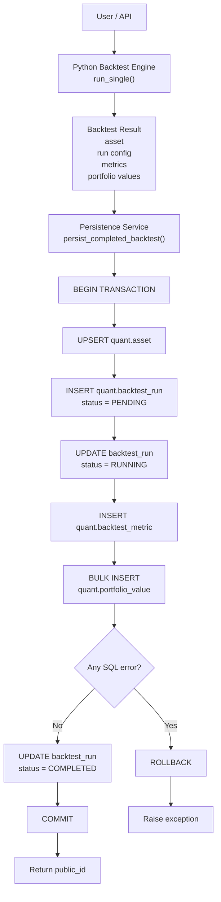

```mermaid
flowchart TD

    USER["User / API"]

    ENGINE["Python Backtest Engine<br/>run_single()"]

    RESULT["Backtest Result<br/>asset<br/>run config<br/>metrics<br/>portfolio values"]

    SERVICE["Persistence Service<br/>persist_completed_backtest()"]

    TX["BEGIN TRANSACTION"]

    ASSET["UPSERT quant.asset"]

    RUN_PENDING["INSERT quant.backtest_run<br/>status = PENDING"]

    RUN_RUNNING["UPDATE backtest_run<br/>status = RUNNING"]

    METRIC["INSERT quant.backtest_metric"]

    VALUES["BULK INSERT<br/>quant.portfolio_value"]

    RUN_COMPLETE["UPDATE backtest_run<br/>status = COMPLETED"]

    COMMIT["COMMIT"]

    ERROR{"Any SQL error?"}

    ROLLBACK["ROLLBACK"]

    SUCCESS["Return public_id"]

    USER --> ENGINE

    ENGINE --> RESULT

    RESULT --> SERVICE

    SERVICE --> TX

    TX --> ASSET

    ASSET --> RUN_PENDING

    RUN_PENDING --> RUN_RUNNING

    RUN_RUNNING --> METRIC

    METRIC --> VALUES

    VALUES --> ERROR

    ERROR -- "No" --> RUN_COMPLETE

    RUN_COMPLETE --> COMMIT

    COMMIT --> SUCCESS

    ERROR -- "Yes" --> ROLLBACK

    ROLLBACK --> FAILED["Raise exception"]
```