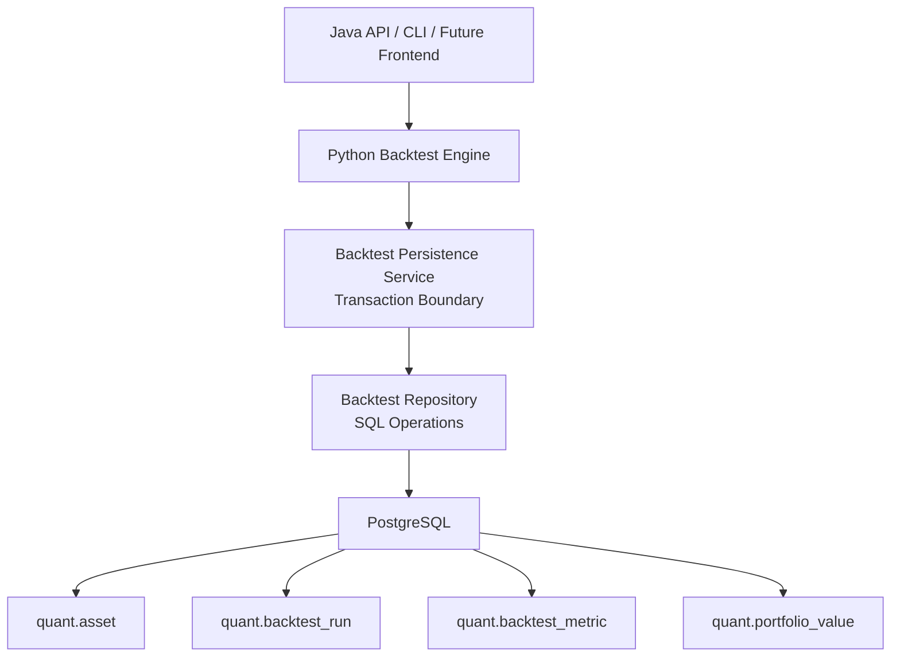

```mermaid
flowchart TD

    API["Java API / CLI / Future Frontend"]

    ENGINE["Python Backtest Engine"]

    SERVICE["Backtest Persistence Service<br/>Transaction Boundary"]

    REPOSITORY["Backtest Repository<br/>SQL Operations"]

    POSTGRES["PostgreSQL"]

    ASSET["quant.asset"]
    RUN["quant.backtest_run"]
    METRIC["quant.backtest_metric"]
    VALUE["quant.portfolio_value"]

    API --> ENGINE

    ENGINE --> SERVICE

    SERVICE --> REPOSITORY

    REPOSITORY --> POSTGRES

    POSTGRES --> ASSET
    POSTGRES --> RUN
    POSTGRES --> METRIC
    POSTGRES --> VALUE
```